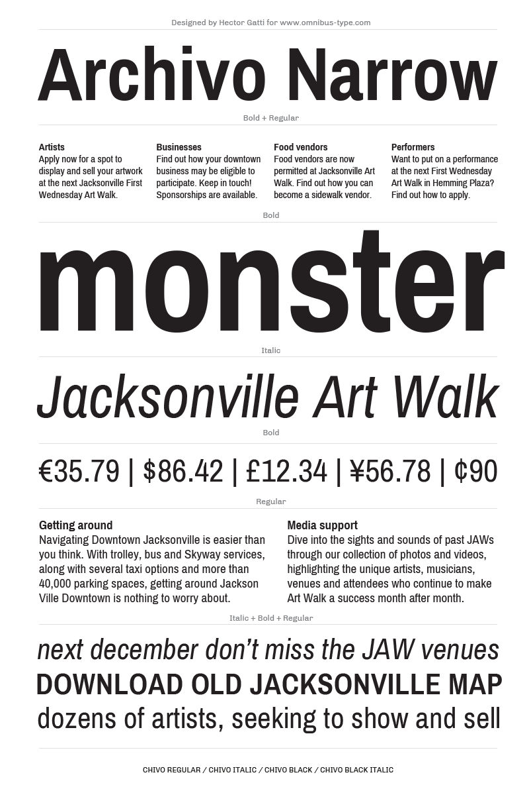

# Archivo Narrow

**Omnibus-Type**  
*SIL Open Font License, 1.1*

Archivo Narrow was designed to be used simultaneously in print and digital platforms. The technical and aesthetic characteristics of the font are both crafted for high performance typography.

Archivo is a *grotesque sans serif* typeface family from [Omnibus Type](http://omnibus-type.com/). It was originally designed for highlights and headlines. This family is reminiscent of late nineteenth century American typefaces. It includes Narrow and Black styles, and was derived from Chivo.

####Archivo Narrow contains:
* Regular/Italic
* Medium/MediumItalic
* Semibold/SemiboldItalic
* Bold/Bolditalic

To contribute to the project contact [Omnibus Type](http://omnibus-type.com/).

### Designers

* Héctor Gatti

## Building

Fonts are built automatically by GitHub Actions - take a look in the "Actions" tab for the latest build.

If you particularly want to build fonts manually on your own computer, you will need to install the [`yq` utility](https://github.com/mikefarah/yq). On OS X with Homebrew, type `brew install yq`; on Linux, try `snap install yq`; if all else fails, try the instructions on the linked page.

Then:

* `make build` will produce font files.
* `make test` will run [FontBakery](https://github.com/googlefonts/fontbakery)'s quality assurance tests.
* `make proof` will generate HTML proof files.

The proof files and QA tests are also available automatically via GitHub Actions - look at `https://yourname.github.io/your-font-repository-name`.

## License

Copyright (c) 2019, Omnibus-Type (www.omnibus-type.com | omnibus.type@gmail.com)

This Font Software is licensed under the SIL Open Font License, Version 1.1.
This license is copied below, and is also available with a FAQ at
http://scripts.sil.org/OFL

## Repository Layout

This font repository structure is inspired by [Unified Font Repository v0.3](https://github.com/unified-font-repository/Unified-Font-Repository), modified for the Google Fonts workflow.

======
## FONTLOG for the Archivo Narrow fonts

This file provides detailed information on the Archivo Narrow Font Software.  
This information should be distributed along with the Archivo fonts and any derivative works.

### Archivo is a typeface family that supports Unicode language range: 

* Basic Latin (95 glyphs),
* Latin-1 Supplement (96 glyphs),
* Latin Extended-A (128 glyphs),
* Latin Extended-B (7 glyphs),
* Spacing Modifier Letters (9 glyphs),
* Latin Extended Additional (8 glyphs),
* General Punctuation (23 glyphs),
* Superscripts and Subscripts (1 glyphs),
* Currency Symbols (4 glyphs),
* Letterlike Symbols (6 glyphs),
* Number Forms (4 glyphs),
* Arrows (7 glyphs),
* Mathematical Operators (17 glyphs),
* Miscellaneous Technical (4 glyphs),
* Alphabetic Presentation Forms (2 glyphs)

*To contribute to the project contact Omnibus-Type at omnibus.type@gmail.com*

**12 August 2018 Archivo Narrow v2.000**
- Updated to GF Latin Plus set
- Supports 219 Latin languages used in 212 countries

**21 May 2017 (Pragati v.1.009)**
- Added alternative ampersand

**5 March 2017 (Pragati v.1.008)**
- Created New Weights: Medium and Semibold

**6 April 2015 (Pragati v.1.007)**
- New ueMatra anchors
- Fixed linked anchors in nukta instances
- Inserted 'lookupflag IgnoreMarks' in pres
- Separated oeMatra from the shoulder
- Inserted rakar anchors
- Fixed Rakar before halant (Half Vattu Nukta)

**27 January 2015 Archivo Narrow v1.003**  
- Removed Reserve Font Name from the license
- Name tables adjusted
- fsType Installable Mode
- Set Panose values
- Updates CFF and TTF hinting
- Unified index glyphs in all family
- Added Family Alignment Zones

**23 June 2013 Archivo Narrow v1.003**
- Fixed Name Table (Thanks to Dave Crossland for his technical input.)
- Updated hinting with ttfautohint (v0.95) with the next values: `ttfautohint -l 8 -r 50 -G 200 -x 14 -w "G" -W [IN-FILE [OUT-FILE]]`

**02 October 2012 Archivo Narrow v1.002**
- Fixed encoding Tables and index (Thanks to Theunis de Jong for his technical input.)
- Fixed TTF Naming Tables

**22 August 2012 Archivo Narrow v1.002**
- Initial release under SIL Open Font License

### Acknowledgements

If you make modifications be sure to add your name (N), email (E), web-address
(if you have one) (W) and description (D). This list is in alphabetical order.

**N:** **Héctor Gatti**  
**E:** omnibus.type@gmail.com  
**W:** http://www.omnibus-type.com  
**D:** Designer

**N:** **Nicolás Silva**  
**E:** omnibus.type@gmail.com  
**W:** http://www.omnibus-type.com  
**D:** Typeface development

**N:** **Pablo Cosgaya**  
**E:** omnibus.type@gmail.com  
**W:** http://www.omnibus-type.com  
**D:** Designer

**N:** **Yorlmar Campos**  
**E:** omnibus.type@gmail.com  
**W:** http://www.omnibus-type.com  
**D:** Typeface development